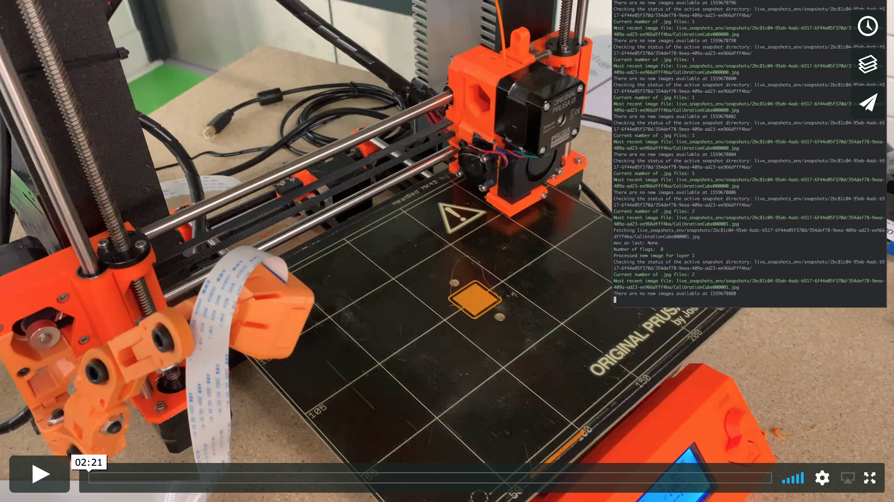

<!-- 

 -->
<h1 align="center">
  Machine Vision Monitoring System for Prosumer 3D Printers
</h1>

  <a href="https://github.com/nebbles">Benedict Greenberg</a>

  Dyson School of Design Engineering, Imperial College London 
  Solo Project – May 2019

<h4 align="center">Guided Demo Video</h4>

	
</h1>
 

Prosumer 3D printers enable low-cost and accessible entry into prototyping and DIY repair. This project aims to reduce material and time wasted due to unexpected errors common in these machines.

## Final Year Project

This repository contains work from my final year project at the Dyson School of Design Engineering. The content may be incomplete. For an extract of what this project is doing, you can read the final report abstract below.

The progress of this project was loosely documented in the logbook directory, [viewed here](logbook/readme.md). In it I record lessons learnt along the way as well as linking to useful resources.

## Abstract

This report aims to give an insight on the approach and analysis of an original technique for detecting errors in real-time during the usage of prosumer 3D printers. These machines are often prone to unexpected errors that cost the operator time and resources. There are many different errors that can occur with these machines, but they can be generally categorised into (1) *Detachment*, (2) *Object Deformation*, (3) *Material Flow*, (4) *Surface Errors*, (5) *Deviation from Model*, and (6) *Mechanical Inconsistency*.

The original technique utilises the print’s g-code to extract the top layer of the ongoing print from a time-lapse snapshot. These snapshots are taken at the start of every layer. They are passed in realtime to a detector algorithm which analyses, along with the previous images in the stack, to determine whether an error has occurred. The algorithm implemented is designed to detect errors from categories (1) and (3). Errors from category (2) have been covered extensively in existing literature which survey the part’s shape to determine whether it has deformed from the intended design.

Evaluation of this methodology has shown a consistently high success rate at detecting errors with two false positives in the fourteen trial runs conducted. This establishes the technique well amongst its peers providing scope for integration into a comprehensive detection system in future development.

## With thanks to

Primary Tutor: **Dr Connor Myant**  
Associate Tutor: **Professor Peter Cheung**  
Industrial advisor: **Dr Robert Deaves** *Principal Engineer (Dyson), Visiting Professorship (Department of Computing)*
