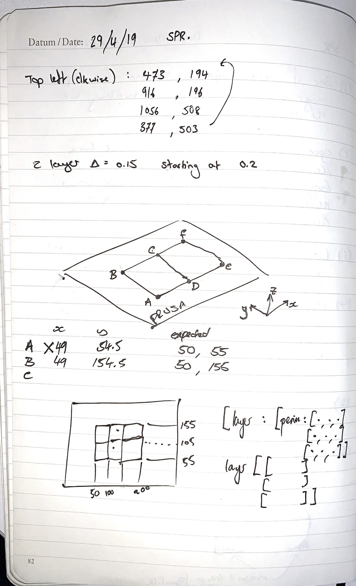
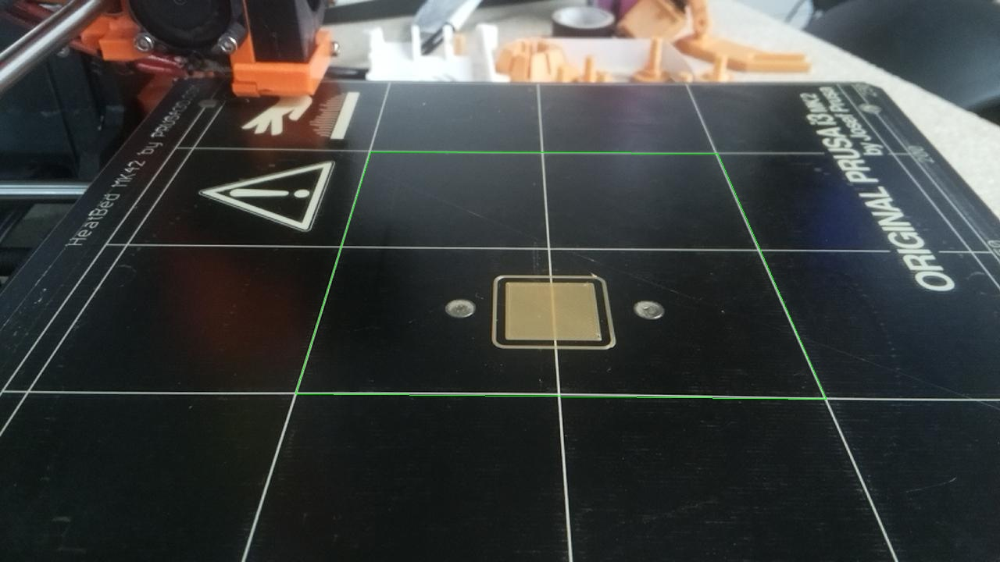
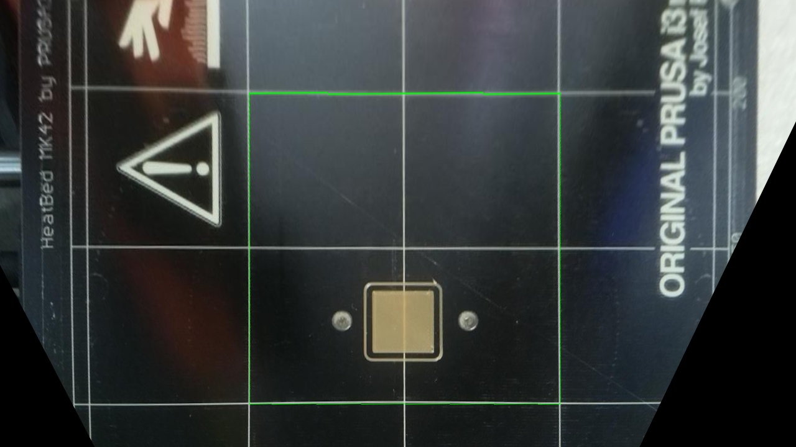
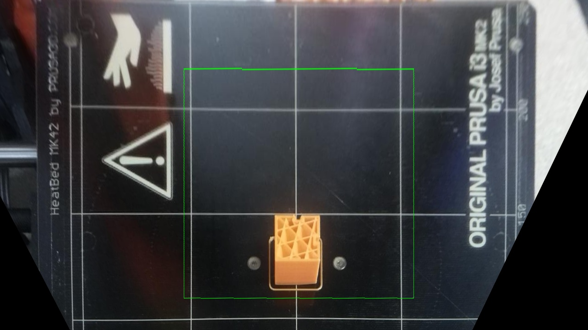
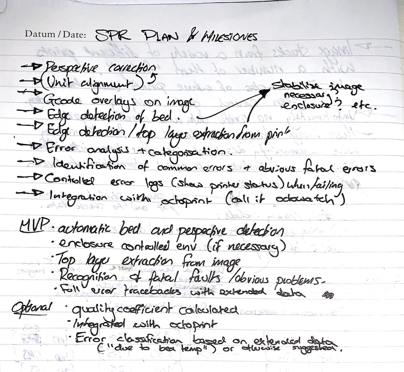
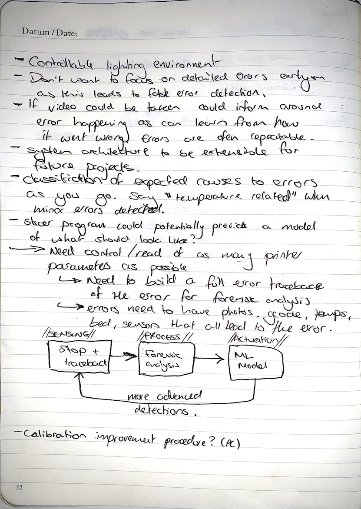

# Logbook

## Overview

1. [02 Nov](#2-November-2018-↑)
1. [16 Nov](#16-November-2018-↑)
1. [23 Nov](#23-November-2018-↑)
1. [30 Nov](#30-November-2018-↑)
1. [11 Jan](#11-January-2019-↑)
1. [17-18 Jan](#18-January-2019-↑)
1. [19 Jan](#19-January-2019-↑)
1. [21-24 Jan](#24-January-2019-↑)
1. [27-29 Jan](#29-January-2019-↑)
1. [31 Jan](#31-January-2019-↑)
1. [1 Feb](#1-February-2019-↑)
1. [20 Feb](#20-February-2019-↑)
1. [Fri 26 Apr](#26-April-2019-↑)
1. [Mon 29 Apr](#29-April-2019-↑)
1. [Tue 30 Apr](#30-April-2019-↑)
1. [Wed 1 May](#1-May-2019-↑)

## [1 May 2019 ↑](#overview)


## [30 April 2019 ↑](#overview)

Spent most of the morning working on the gcode parser fixing various bugs until it was reliable. For some reason there are 133 (valid) recordings of a layer change. These mark the beginning of each layer and even the first layer of filament laid is considered a layer change beforehand. Therefore the gcode seem to have 133 extruded layers of filament, however the image stack collected by the Octopi recording seems to have images of only the first 132 layers (with a blank one beforehand; 133 total). This leads me to believe a final image is not taken by the timelapse software. This is not a major issue, as this is the last layer of the print and is negligble in utility to this project.

Next, moved onto coordinte system transforms. The coordinates extracted from the gcode perimeter data, need to be converted in `u, v` coordinates according to the warped image. For this, the manually verified anchor points were used to provide linked references between each coordinate system. Beyond that, I've had to wrestle with the strange requirements of the OpenCV functions wrt the structure of the data in numpy arrays.

Main issue with the `perspectiveTransform()` [function](https://docs.opencv.org/2.4/modules/core/doc/operations_on_arrays.html#void%20perspectiveTransform(InputArray%20src,%20OutputArray%20dst,%20InputArray%20m)) was solved with [this SO post](https://stackoverflow.com/questions/45817325/opencv-python-cv2-perspectivetransform) and as such the np array was reshaped with the help of [this SO post](https://stackoverflow.com/questions/49788723/whats-the-mean-of-reshape-1-1-2) and [example 1 from here](https://www.programcreek.com/python/example/89377/cv2.perspectiveTransform).

Eventually got that working, despite CV fighting back. Result showed that for layer 100 of the print, where there are two perimeters extruded, the second perimeter was the outer one. This indicates that the layer prints perimeters inside-out. This needs to be verified with a layer that contains more than the standard two outer perimeters. See image below.

<p align="center"></p>
<p align="center"><sup><i>Layer 100, perspective corrected with perimeters gcode overlayed in two colours (with extrusion plane in green)</sup></i></p>

## [29 April 2019 ↑](#overview)

Began with calibrating carefully by hand the keypoints on the bed in the first frame. This would ensure the perspective correction could be as accurate as possible. Next, processed the full image stack, adjusting warp perspective of every image.

<p align="center"></p>
<p align="center"><sup><i>Layer 100, perspective corrected with perimeters gcode overlayed in two colours (with extrusion plane in green)</sup></i></p>

Physical measurements were taken from the machine through gcode experimentation. The following block of code was iterated until it correctly traced the centre blocks of the Prusa bed (X100 Y55 to X150 Y155). It shows that the bed markers are not perfectly aligned to the control system.

> M83              ; sets extrusion measurements to relative  
> G1 X99 Y55       ; bottom left corner  
> G1 X149 Y55 E10  ; bottom right corner  
> G1 X149 Y155 E10 ; top right corner  
> G1 X99 Y155 E10  ; top left corner  
> G1 X99 Y55 E10   ; bottom left corner  
> G1 X5 Y5         ; move near home  

Even with the iteration of the above code, the resulting extrusion was a slight underestimation on the X axis, and marginally too high on the Y axis. Ideal correction would be around probably be within 0.3 millimetres, and so for the sake of this early calibration this isn't necessary.

The bed markers on the prusa are set in 50 mm intervals in both X and Y axis.

The gcode file reports the z-layer in a slightly more convulted way than anticipated. Rather than having the absolute layer number, the z-height is reported, e.g. 

> ;AFTER_LAYER_CHANGE  
> ;1.4  

In order to split the file into its relevant sections, the z-height must be converted into z-layer. The difference in height between layers is 0.15 mm and the first layer (layer 1; zero is empty) is at 0.2 according to the test file.

Additionally, there is multiple perimeter sets found for each layer. Fortunately they can be split apart, but cannot be identified. So began work on a custom gcode parser to detect and extract the different perimeters. These are then stored as follows:

    → array of layers  
      ↳ array of perimeters  
        ↳ array of XY coordinates in the perimeter  
          ↳ dictionary of 'x' and 'y' coordinate respectively  

So, layer 110 for example was processed to this:

> [{'X': '134.775', 'Y': '95.225'},  
>  {'X': '134.775', 'Y': '114.775'},  
>  {'X': '115.225', 'Y': '114.775'},  
>  {'X': '115.225', 'Y': '95.225'},  
>  {'X': '134.715', 'Y': '95.225'}]  
> [{'X': '115.643', 'Y': '95.643'},  
>  {'X': '134.357', 'Y': '95.643'},  
>  {'X': '134.357', 'Y': '114.357'},  
>  {'X': '115.643', 'Y': '114.357'},  
>  {'X': '115.643', 'Y': '95.703'}]  

The next stage will be to draw these perimeters, each with a different colour, over the warped images saved from earlier work. Hopefully this will help to identify which perimeter is the external one (inside-out extrusion or outside-in extrusion).

## [26 April 2019 ↑](#overview)

I will now aim to keep this log with more ongoing details, rather than summarising key areas completed.

Previously planned milestones set as follows:

1. Perspective correction
2. Unit alignment
3. Gcode overlays on imaging for confirmation
4. Edge detection on the bed (for automatic unit alignment)
5. Top layer extraction from image
6. Error analysis (identification, categorisation, severity)
7. Detailed logging
8. Integration with octoprint

This however has been superceded. Instead, in the immediate future, offline analytical work of various imaging techniques will be prioritised. Below are extract from alternative notes.

    (1) See if the previous image is similar for the top layer area. This may work
    as this should actually be the part of the image that has changed the least.

    (2) Extract gcode of the outer loop of the top layer that has just printed.
    Using thresholding, look for filament colouring inside vs outside of this outer
    extrusion region.

    (3) Line/pattern matching between filament pattern of top layer and gcode (exact 
    methodology to be determined still).

    (4) Using decision tree type elimination to determine type of error based on 
    the image analysis technique.

    There should also be a noticeable error change over multiple frames that could 
    be thresholded, which would allow for a gradual deterioration of print quality.

    (5) Shape analysis of gcode and warped imaging.

    (6) Further analysis into first-layer print warping could be analysed using 
    the image correction technique used to adjust persepctive (as it doesn't keep 
    an expected profile).

Developments and commentary will be post here.

## [20 February 2019 ↑](#overview)

Successfully managed to warp perspective based on key anchor points marked onto the bed of the Prusa. These are dimensioned and therefore can be related to gcode coordinates at a later date. Images below show success of warping image with the active extrusion plane overlayd (in green).

<p align="center">
    
    
</p>
<p align="center"><sup><i>Layer 0 (empty layer) with calibration square overlayed. Pre and post perspective warp.</sup></i></p>

<p align="center">
    
    
</p>
<p align="center"><sup><i>Layer 1 with extrusion plane overlayed. Pre and post perspective warp.</sup></i></p>

<p align="center">
    
    
</p>
<p align="center"><sup><i>Mid-print layer with extrusion plane overlayed. Pre and post perspective warp.</sup></i></p>

<p align="center">
    
</p>
<p align="center"><sup><i>Planning on MVP and target features</sup></i></p>

## [1 February 2019 ↑](#overview)

- Modified the camera mounting arm to a higher position. 
- Altered the position for taking layer snapshots so that camera position is square with bed.
- Began collection of first image stack for anlysis purposes.

## [31 January 2019 ↑](#overview)

- Need more links to the articulated arm camera mount. Began print for some extra links.
- Identified settings preset for `mjpg-streamer` for Raspberry Pi. Configuration is set in `/boot/octopi.txt`. Available presets are [here](https://discourse.octoprint.org/t/available-mjpg-streamer-configuration-options/1106). Began by adjusting resolution up to 720p.
- Camera still had protective film over lens. This was dramatically reducing light capture and reducing image quality and focus.
- Lens needed to be manually focused on the Camera Module V2. To do this, the lens was rotate counterclockwise (using tweesers). This meant that closer object moved into focus, which was desired for a relatively close print image.
- Today was a good day for camera quality.

## [29 January 2019 ↑](#overview)

- Completed timelapse showed camera orientation was incorrect, lighting was fairly consistent but not ideal for analysis and camera quality was very poor.
- Camera arm bolt broke so new prints need to be started for that.
- Further improvements to camera snapshots needed from configuration. Working on this.

## [27 January 2019 ↑](#overview)

- More bed corrections to Wanhao printer to get reliable print.
- Adjustments to slicer configuration to Prusa to avoid failed prints.
- Continued manufacture of new camera mount arm and assembly.
- Started first timelapse with camera on new arm.

## [24 January 2019 ↑](#overview)

- Trialled alternative materials on Prusa printer to see success rate. Proved to find any new material difficualt, even PLA/PHA variant.
- Continued to build new camera mount parts for better image stacks.
- Investigated aluminium profiles for easy build enclosure [on Amazon](https://www.amazon.co.uk/slp/aluminium-profile/ve7pozj29pbn5kk)

## [22 January 2019 ↑](#overview)

- Continued with (software) preparation for new camera mount.

## [21 January 2019 ↑](#overview)

- Installed new Raspberry Pi casing which is mounted to the frame of the Prusa.
- Connected camera with new 2m cable. Used original position of bottom left corner for the time being.

## [19 January 2019 ↑](#overview)

- Finalised usage of reverse tunnel to remotely access web interface of Prusa octoprint. This is written in the form of a bash script that will be stored in the `misc/` directory. Script is called `serve-web`. See file for more information.
- Made a new cronjob that would start up the reverse tunnel correctly after a Pi reboot: `@reboot /home/pi/bin/serve-web > /home/logs/serve-web.log 2>&1`
- Investigating some additional useful plugins for octoprint that may help with printer management (marks signify package was used):
    - [ ] [Octoprint Anywhere](https://plugins.octoprint.org/plugins/anywhere/)
    - [x] [Exclude Region](https://plugins.octoprint.org/plugins/excluderegion/)
    - [x] [Detailed Progress](https://plugins.octoprint.org/plugins/detailedprogress/)
    - [x] [Print History](https://plugins.octoprint.org/plugins/printhistory/)
    - [x] [Print Time Genius](https://plugins.octoprint.org/plugins/PrintTimeGenius/)
    - [x] [Octolapse](https://plugins.octoprint.org/plugins/octolapse/)
    - [x] [File Manager](https://plugins.octoprint.org/plugins/filemanager/)
    - [ ] [Multiple Upload](https://plugins.octoprint.org/plugins/MultipleUpload/)
    - [ ] [STL Viewer](https://plugins.octoprint.org/plugins/stlviewer/)
    - [ ] [Cancel Object](https://plugins.octoprint.org/plugins/cancelobject/)
    - [x] [Extra Distance](https://plugins.octoprint.org/plugins/extradistance/)
    - [ ] [Fan Speed Control](https://plugins.octoprint.org/plugins/fanslider/)
    - [ ] [Floating Nav Bar](https://plugins.octoprint.org/plugins/floatingnavbar/)
    - [ ] [Gcode Editor](https://plugins.octoprint.org/plugins/GcodeEditor/)
    - [x] [Simple Emergency Stop](https://plugins.octoprint.org/plugins/simpleemergencystop/)
    - [ ] [Better Heater Timeout](https://plugins.octoprint.org/plugins/BetterHeaterTimeout/)
    - [x] [Nav Bar Temp](https://plugins.octoprint.org/plugins/navbartemp/)
    - [ ] [Enclosure](https://plugins.octoprint.org/plugins/enclosure/)
    - [x] [Themeify](https://plugins.octoprint.org/plugins/themeify/)
    - [ ] [Tab Order](https://plugins.octoprint.org/plugins/taborder/)
    - [x] [Printer Statistics](https://plugins.octoprint.org/plugins/stats/)

- [Created](https://nerderati.com/2011/03/17/simplify-your-life-with-an-ssh-config-file/) an SSH config (`nano ~/.ssh/config`) to use an [SSH jump](https://wiki.gentoo.org/wiki/SSH_jump_host) to reach the Pi behind Imperial firewall:

    ```
    Host spr-prusa
            Hostname spr-prusa
            User pi
            ProxyJump serveo.net

    # Equivalent to: ssh -J serveo.net pi@spr-prusa
    ```

    This was done whilst the serveo reverse tunnel was already temporarily established on the Pi side. At this point I had not developed a script to run it automatically: `ssh -R spr-prusa:22:localhost:22 serveo.net`

- Plan to use [SSH keys](https://askubuntu.com/questions/46930/how-can-i-set-up-password-less-ssh-login) for passwordless login on SSH. Followed the following steps:

    ```
    $ ssh-keygen

    ... key is created ...

    $ ssh-copy-id spr-prusa
    ```

    Note that the `-i` flag should be used to specify which identy you want to be copied to the remote host.

- With automatic log-in and a short ssh command set up using a config file to access the Pi remotely, the final step was just to ensure that the SSH reverse tunnel set up previously stays alive. For this a script was set up similar to before and is named `serve-ssh` which can be found in the `misc/` directory. This new script will handle the tunnel responsible for administrative access through port 22 rather than web traffic aimed for port 80 to reach the Octoprint dashboard.

## [18 January 2019 ↑](#overview)

- Started manufacturing a new camera mount that will be fixed relative to z axis of hotend.
- Further research on reverse tunnelling to assist with remote monitoring.

## [17 January 2019 ↑](#overview)

- Rebuilt SD with Octoprint on and reinstalled remot3.it (weaved) as a backup to remote connection. Note that my effective `wpa_supplicant.conf` for Imperial wifi is stored in the `misc/` directory of this project.
- 3D printed a camera mount for the Pi camera. Fixed it to lower right corner of bed. Unfortuantely I think there is risk of this being too low an angle; camera being fixed relative to the bed is useful however.
- Manufactured a case for Pi to secure to the Prusa. This requries a longer flex cable from Pi to camera however.
- Ordered two longer camera flex cables for Prusa Pi and ultimately the Wanhao Pi once set up.
- Wanhao printer set up an calibrated (no accompanying Pi yet). Some test prints run on it.
- The intial aim is to have Octoprint set up for both printers and taking time lapse photos. The quality and control of these images from the octoprint interface has to be established. This may mean that more granualr control is needed through an alternative, or custom, plugin to the octoprint platform.
- Initial research conducted into how to use reverse tunnelling to bypass Imperial firewalls and remotely monitor the printers.

## [11 January 2019 ↑](#overview)

<p align="center"></p>
<p align="center"><sup><i>Discussion notes from meeting with Tutor (C. Myant), Associate Tutor (P. Cheung), and Industrial Advisor (R. Deaves)</sup></i></p>

## [30 November 2018 ↑](#overview)

- Found a simple protective frame for the Pi. Started printing it.
- Identified an appropriate flex cable. for the camera. About to look into a camera mount design.
- Checked to see if there was any way to stream a preview of the video stream over SSH. 
- Want to avoid VNC due to clunky workflow.
- Looking into streaming to a remote web browser instead
- Want to set up stream via python rather than bash
- Found a python based video stream server for camera https://randomnerdtutorials.com/video-streaming-with-raspberry-pi-camera/

## [23 November 2018 ↑](#overview)

- New printer, Prusa MK2 (lent by Prof. P Cheung) is up and running – calibration took most of the day but now is acting well.
- Basic control of the printer with Python over a serial connection has been proven but not yet tested extensively.
- Next up:
  - will be trying to see if I can stream a whole gcode file to the printer in realtime
  - will look into gcode injection which will be needed for taking photographs (getting print head out the way)

## [16 November 2018 ↑](#overview)

- Spent day trying to get BQ Hephestos 2 calibrated and operating properly. Mostly failed. Had particular issues trying to get the hot end extrude consistently.
- Plan to source alternative backup printer if the issue continues.

## [2 November 2018 ↑](#overview)

- Initial search into 3D print errors (document on Drive). Further categorisation of errors still to come and analysis of which are able to visual detection and which can be potentially corrected in realtime through Gcode control is yet to be set.
- A brief shopping list has been put together to understand what is needed to get some primitive control and testing up and running. Focus will be on a single point of camera to start with.
- Control will be over serial using Python if possible. This will allow for more granular control. Some existing source code and methodologies have been found online through preliminary research and will be verified once the hardware is up and running.